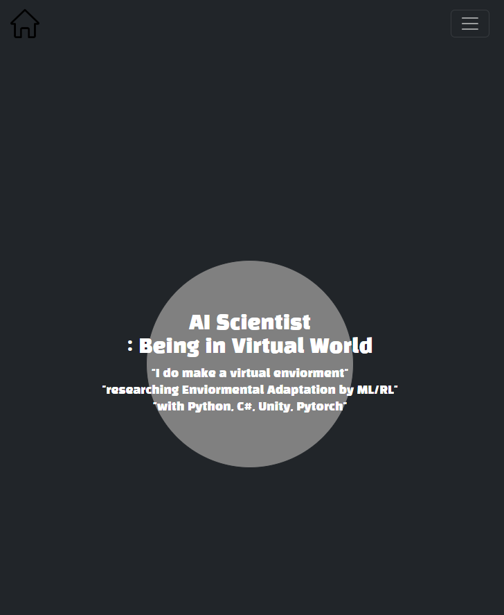
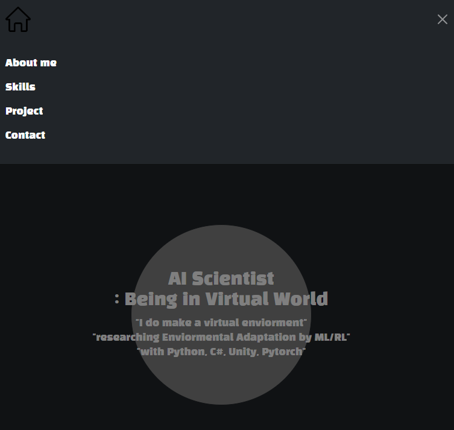
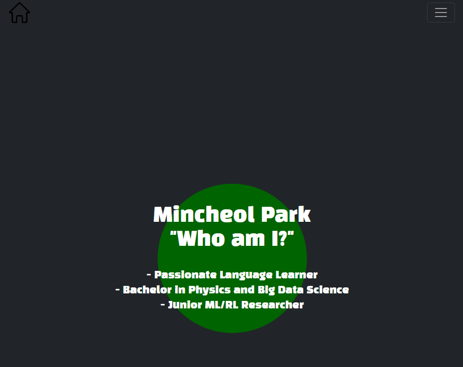
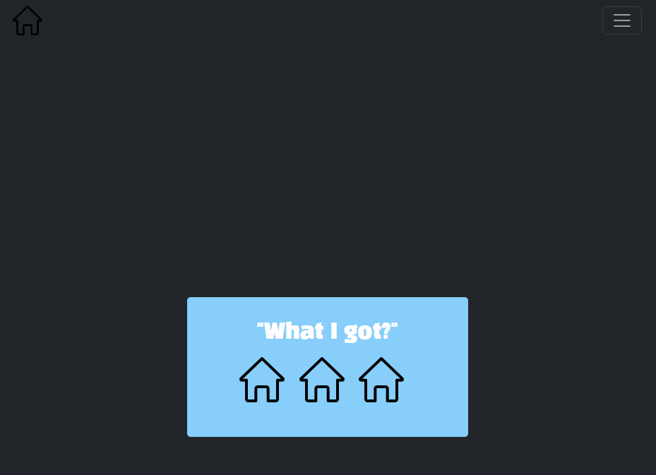
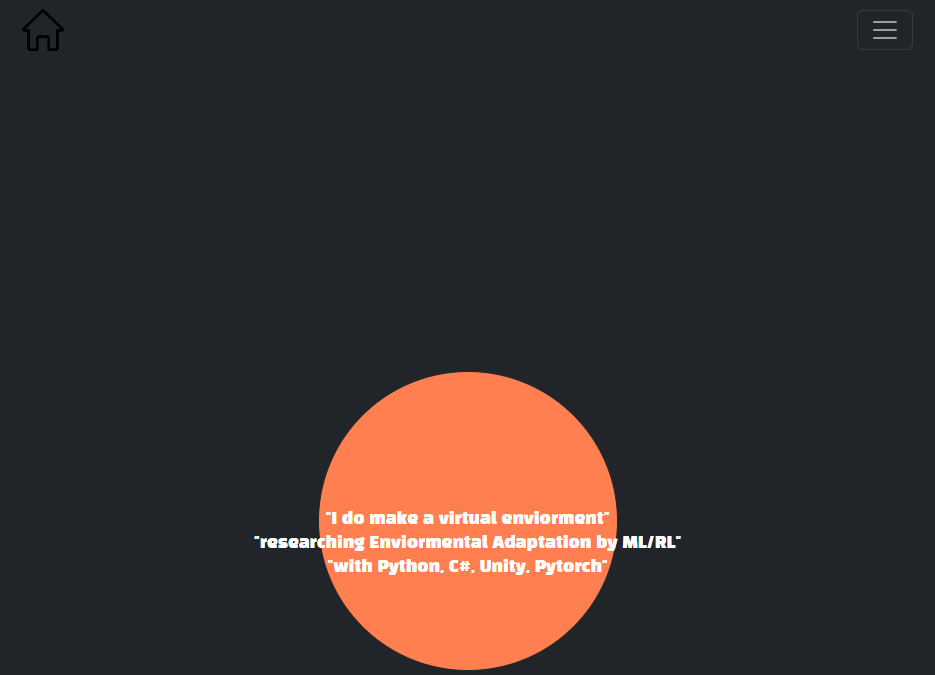
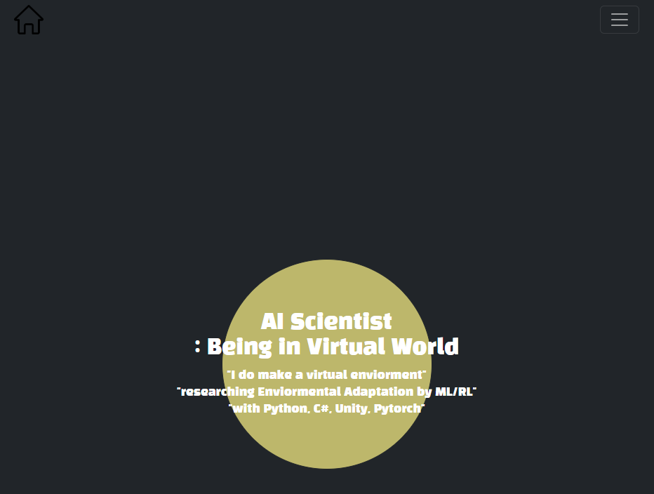

# 03_pjt

---

세 번째 관통 프로젝트를 진행하면서, 직접 배운 html, css, bootstrap, django 등 여러가지를 활용해서 본인 포토폴리오를 만들었다.

깨닳은게 있다면, 많은 기업들이 깡으로 CSS를 사용하는 경우도 꽤나 있었고, JS를 넣어서 애니메이션 효과를 이쁘게 준 경우가 많았다. 특히, 나는 bootstrap에서 토글 활용을 해서 구현하긴 했지만, z-index를 높혀두고, hidden과 show를 통해서 메인메뉴를 중앙에서 띄우는 등의 기능을 구현하는게 되게 매력적이었다.

--- 
## 메인 페이지 구성

메인 페이지 구성은 심플하게 구성해보고자 했다.

추가적인 작업이 많이 필요하다.
추가적으로 footer에 fixed-bottom된 화살표로 views를 조절하면 될 것 같다.

# 프로젝트를 마무리하며,

---
이 관통 프로젝트를 하면서, CSS layout을 구성하는게 그렇게 쉽지 많은 않았다는 것을 뼈저리게 느꼈다. 저번 주에 CSS 활용이 너무 힘들었는데, 그걸 다시하려고 하니까 너무 머리가 복잡하고 힘들었다.

