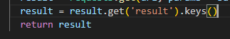
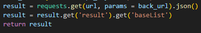
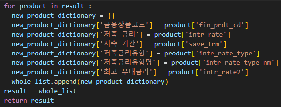
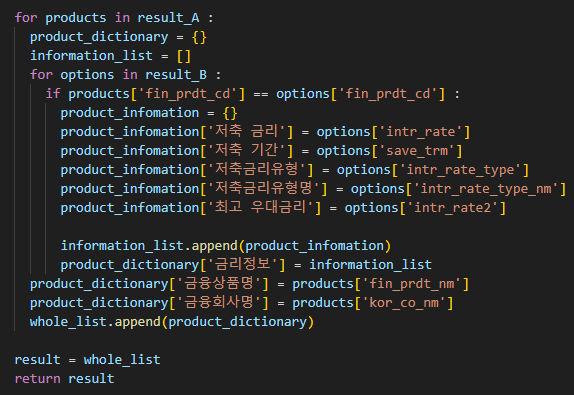

# 01_pjt

---

첫 번째 관통 프로젝트를 진행하면서, API_KEY를 활용하는 방법을 잘 배웠습니다.

특히, json()에서 dictionary로 되어 있는 data를 불러오는 방법을 get() method를 통해서 받는 법을 배웠습니다.

--- 

## problemA

---

- dictionary의 keys() method를 이용하여, data의 'result'키에 할당된 key들을 불러오는 것을 알았다.
기존 python 내의 keys(), values()를 사용해서 따로 뽑아내는 코드를 돌렸던 적이 있어서 쉽게 해결했던 것 같다.

- 항상 built-in function을 생각해내는것은 언어를 자주 사용해야 한다고 생각되는 문제였다.

## problemB

---

- 앞선 문제와 비슷하지만, 키가 'baselist'인 데이터를 출력하기 위해서는 먼저
raw_data를 직접 확인해서 그 구조를 파악하는 일이 먼저였다.

- 리스트 안에 딕셔너리 안에 밸류 값이 또 리스트로 들어가고, 딕셔너리가 또 존재하는 등
인덱싱을 치밀하게 해야지 도달할 수 있는 구조가 있을 수 있다는 것을 경각심을 갖는 시간이었다.

## problemC

---

- 새로운 딕셔너리를 만들 때, 남들과 다른 방식으로 했을 것 같지만(?),
딕셔너리의 새로운 키값을 받아서 필요한 밸류만 지정하여 딕셔너리를 만들고, 새로 리스트화 시켜서
그것을 저장하는 것까지 반복문을 돌려보았을때, 코드를 머리로 짜는 것도 있지만

- 확실히 **직접 써가면서** 하는 것이 최고로 좋은 것 같다.
내가 놓치는 부분이 무엇인지 직접 써가면서 플로우를 작성해보면, 가시화도 되고 몇 번 도는 것 까지 이해할 수 도 있었다.

## problemD

---

- 다른 사람들보다 살짝 빨리 끝나서 오전부터 지금 readme.md을 수정하기 전까지 고민하면서 어떻게 해야 새로운 품목을 받아서 딕셔너리와 리스트를 저장할 수 있을지 계속 고민했다.

**첫 번째는,** 구조를 먼저 그려봤다. 언제 어떻게 몇 번의 for문을 돌려야 논리가 맞는지 생각하기 위해서다.

**두 번째는,** list와 dictionary의 초기화가 중요했다. 적재적소에 명확히 초기화를 해주는게 중요했다.

---
# 프로젝트를 마무리하며,

처음에는 은행 데이터를 가공하는 것을 쉽게 생각했다. 하지만, 구조를 파악해서 직접 구성하는 것이 쉽지 않다.

주간에 배웠던 Python 복습을 진행하고나서 시간이 되면, 첫 번째 관통 프로젝트의 버젼 2인 book과 artist json 파일을 가지고 데이터 구조를 공부해봐야겠다.

