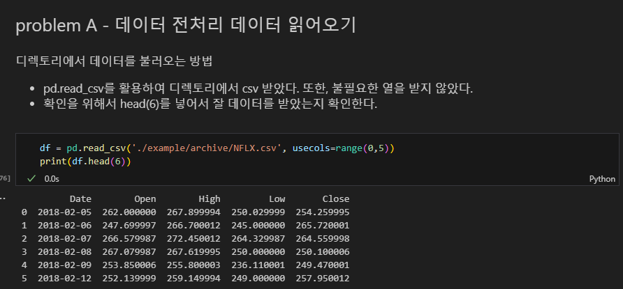
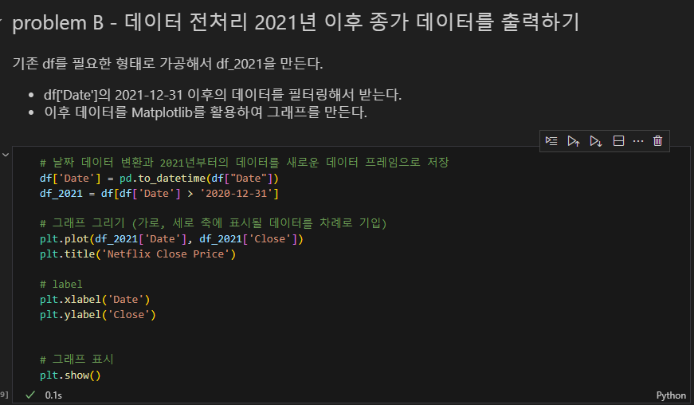
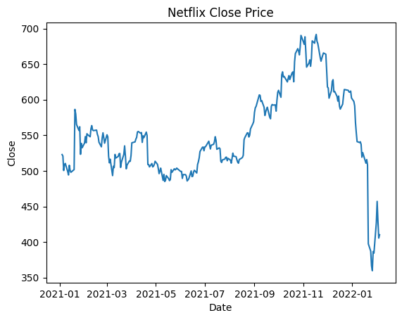
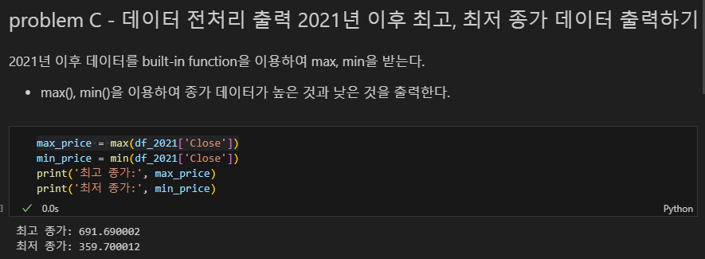
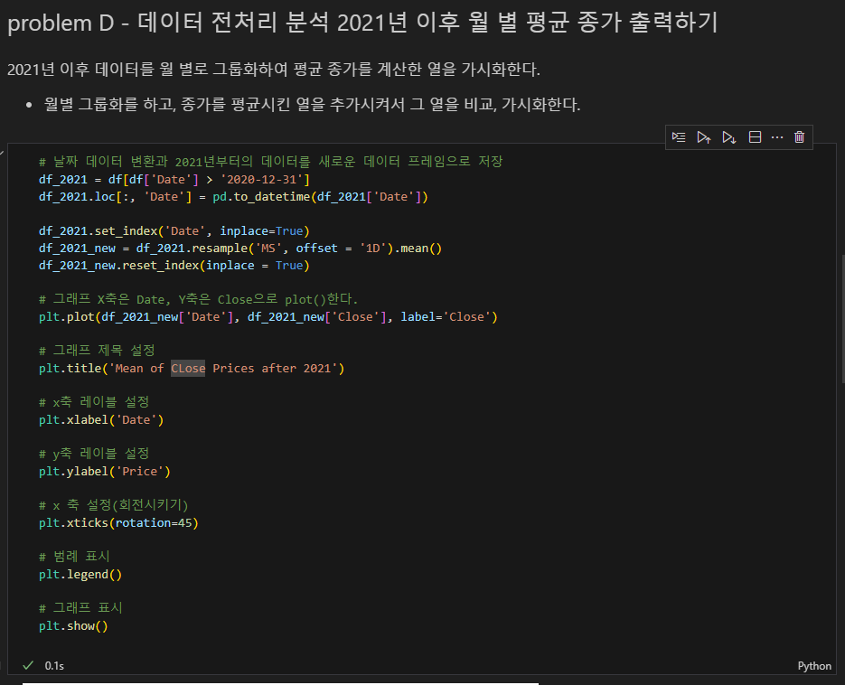
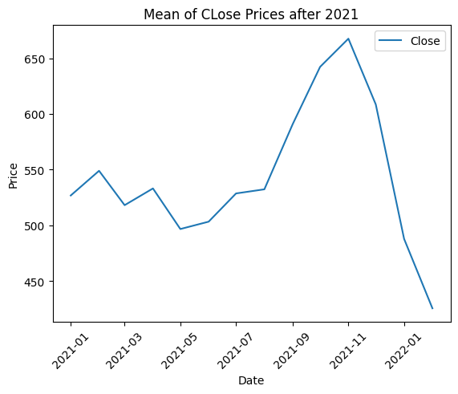
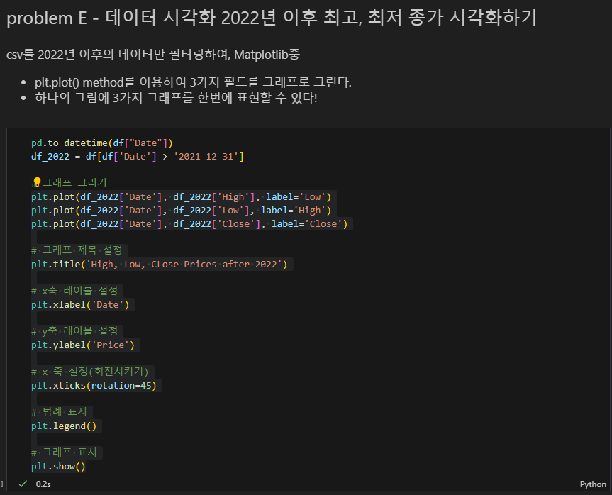
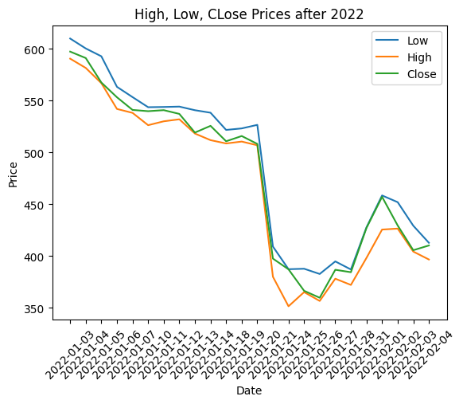

# 02_pjt

---

두 번째 관통 프로젝트를 진행하면서, 학부때 배웠던 numpy, pandas, matplotlib을 활용하는 방법을 잘 배웠습니다.

Python을 배우고, 여러 라이브러리를 사용했었지만, 데이터 가공과 데이터 시각화를 한지 꽤 오랜 시간이라서 기억이 잘 나지 않아 천천히 라이브러리 문서를 보면서 확인해갔다.

--- 

## problemA

---



- pd.read_csv로 대부분 dataset을 불러왔던게 기억이 났다. 디렉토리를 설정하고, usecols를 통해서 0번째 열부터, 4번째 열까지 필요한 열을 뽑았다.

- 실제 데이터 셋을 불러와 확인할 때, 많은 경우 head()를 활용해서 항상 6개 ~ 10개 정도의 데이터만 추려서 보는 것 같다.

## problemB

---



- 2021년 이후의 데이터 타입을 새로운 데이터 프레임으로 저장했다.

- pandas 라이브러리의 dataframe, series를 사용하는 것은 [] 괄호를 사용하여 조건을 작성해서 정의를 하면 새로 개체로 저장 할 수 있다.



- 기존에 코드를 작성하여, matplot 라이브러리를 활용해 그래프를 그릴때, x의 구분선의 변화를 아래 두 코드를 사용해보면서 확인할 수 있었다.
```
df = pd.to_datetime(df['Date'])
```

```
df['Date'] = pd.to_datetime(df['Date'])
```

## problemC

---



- 앞선 문제에서 가공한 것을 가지고, 새로운 변수 정의를 해주었다. max_price, min_price를 built-in function max(), min()을 활용하여서 출력해 보았다.

- 조금 더 깔끔하게 보려면 round를 활용하여 소수점 두 째자리까지 출력하는게 좋아보인다.

## problemD

---



- 이 부분에 제일 핵심이고, 어려웠던 것 같다. DataFrame의 경우, 여러 방식으로 groupby할 수 있다는 것을 학부시절 알고 있으면서 항상 어려워 해서 기피했던 것 같다.

- 다양한 방식으로 그룹화 시킬 수 있고, 다양한 방식으로 필터링 할 수 있는 것을 개인적으로 여러번 연습해야할 것 같음을 느꼈다. 처음 이 문제를 보았을때, 그룹화에 대한 컨셉과 해결책은 떠올랐지만, 막상 코드화 시키려고 하니 버벅거리고, 중간중간 Error를 보게 되는 등 쉽지 않았다.

- pandas의 groupby는 직접 csv를 통해서 데이터 가공을 여러가지 방식으로 해 볼 필요성이 있는 것 같다. 가령, Open Price가 높은 순으로 뽑아서 50달러의 period 기준으로 나눠 그룹핑해서 패턴을 파악할 수 도 있을 것이다.



- 다음은 Mean of Close Prices를 Month Date로 그래프화 시켰다. 여러 날짜를 받아서 하는 것보다 X축의 변수가 많지 않고, 여러 데이터를 Mean()시켜서 그래프가 더 rough하게 나옴을 확인할 수 있다.

## problemE

---



- 데이터 시각화는 2022년 이후 최고, 최저, 종가를 시각화하는 작업이었다. problemB에서 수행했던 데이터 슬라이싱을 할 수 있다.

- 하나의 그림에 3개의 plot() method를 사용해서 그리면, 하나의 그래프 사진에 3개의 그래프를 한번에 담을 수 있다. 비교 분석하기에 쉽게 볼 수 있으며, 여러가지 plot type으로 box_plot등을 사용해 데이터의 활용 분야마다 다를 수 있다.

- 또한, 범례 사용을 하여, legend() method를 활용하면, 어떤 그래프가 어떤 색인지 확인을 바로 할 수 있다. 현재 default position 위치에 지정되어 있으며, 이를 때에 따라서 다른 위치로 보낼 수 있다.



- 다음은 2022년의 1월 데이터가 있는 것부터, 2월 데이터가 있는 것까지 출력하여 보여줬다. High, Low, Close의 Prices를 3개 plot()한 경우이다.

# 프로젝트를 마무리하며,

---

기존에 라이브러리를 사용하는 건 익숙했다. 하지만, 익숙하다고 **생각만** 들었던 것이다. 실제 코드를 작성할 때, 스켈레톤 코드가 없다면, 아마 많이 힘들었을 것 같다.

- 이 관통 프로젝트를 하면서 느낀건 따로 Pandas 라이브러리를 활용해서 DataFrame 연습을 열심히 해야할 것 같다.


