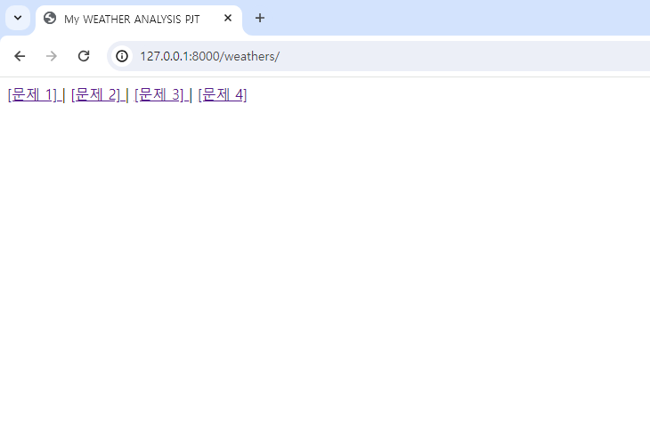
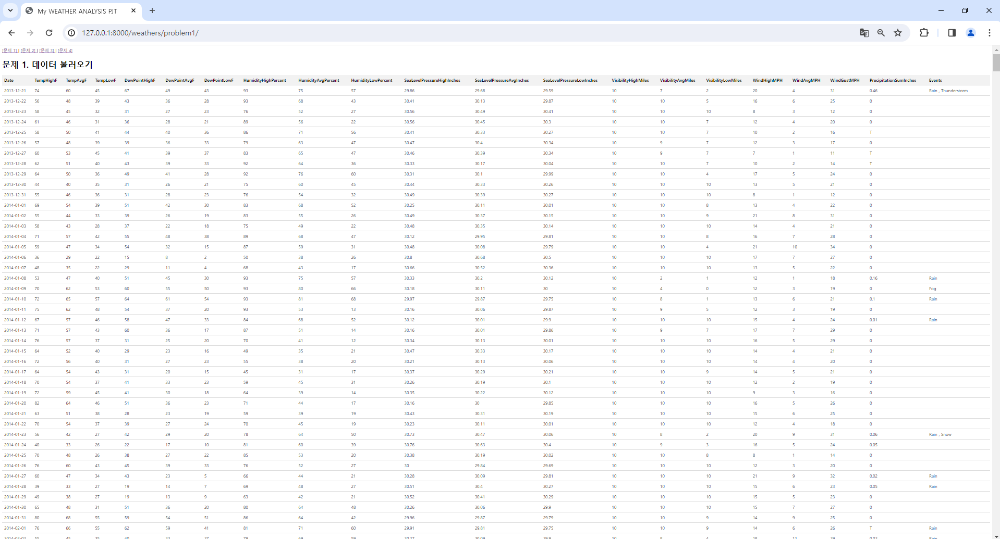
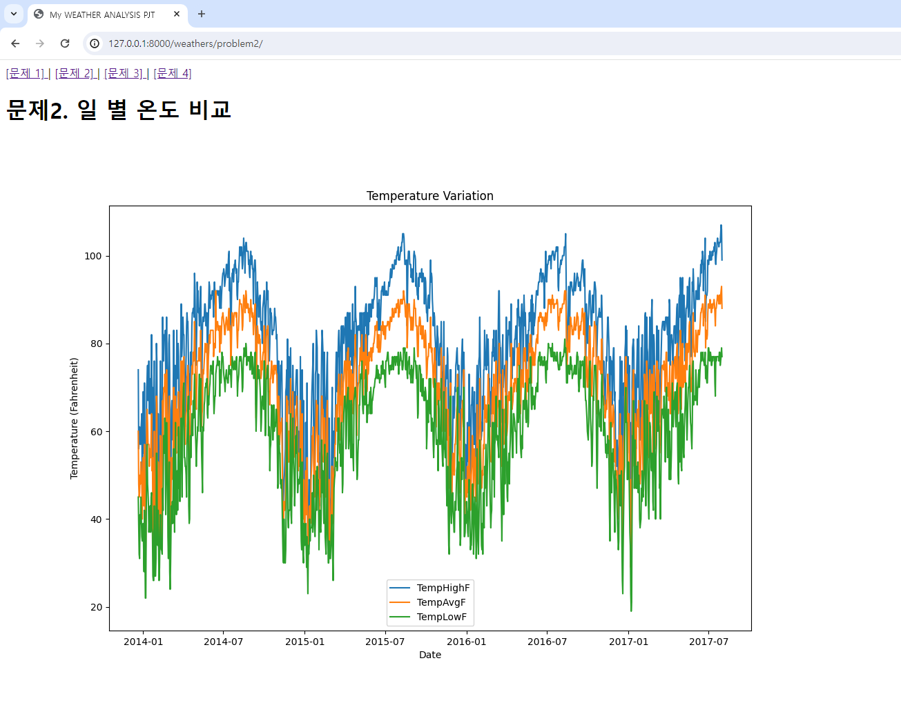
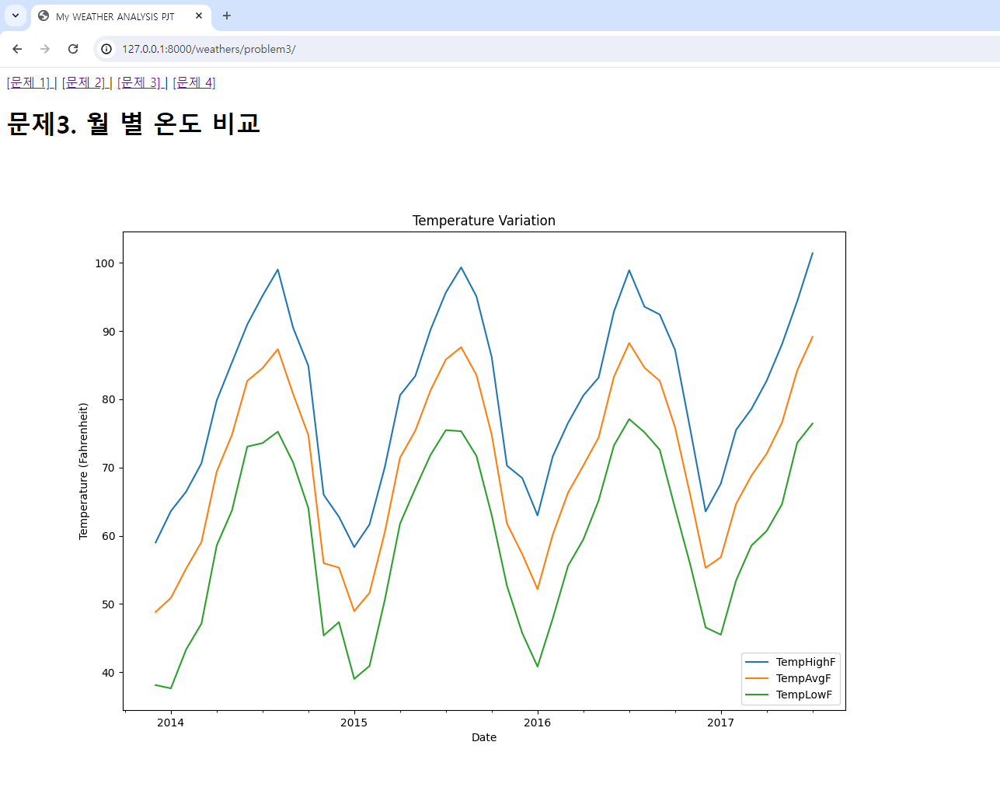
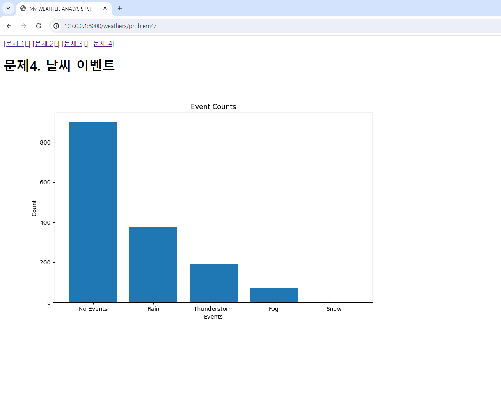

# 04_pjt

---

네 번째 관통 프로젝트를 진행하면서, 배운 django를 이용한 date_based_html을 구현했다.

확실히 오랜 기간동안 numpy, pandas, matplotlib를 안쓰다보니까 너무 손에 안 익었다.
심지어 학부시절에 어렵다고 느꼈던 groupby를 이번에도 쉽게 하지 못했다. (원하는 방향은 다중 그래프를 그릴 때, col 별로 넣고 싶었다.)

깨달은게 있다면, 

깨닳은게 있다면, 많은 기업들이 깡으로 CSS를 사용하는 경우도 꽤나 있었고, JS를 넣어서 애니메이션 효과를 이쁘게 준 경우가 많았다. 특히, 나는 bootstrap에서 토글 활용을 해서 구현하긴 했지만, z-index를 높혀두고, hidden과 show를 통해서 메인메뉴를 중앙에서 띄우는 등의 기능을 구현하는게 되게 매력적이었다.

--- 
## 페이지 구성

index 페이지를 구성해 줬다. (빈 주소 입력될 때, 오류 띄워주는게 너무 별로였다.)
오히려 project.urls에 path('')를 할 걸 그랬다.

### 데이터 불러오기 - 함수 구성
함수 구성을 하지 않게 되면, DataFrame이 얕은 복사가 이뤄져서 중간에 바뀌게 된다!
views 함수의 함수 호출만 html에서 연결되기에 처음 받은 DataFrame이 계속 데이터가 덧 씌워지게 된다..
그럼 결국엔 다른 페이지로 갈 때,(view 함수 호출이 일어날 때, 데이터를 변동하는 함수라면) 데이터가 변화된 채로 페이지를 넘나들 것이다. 

시간이 오래 걸릴 수 있겠지만, 매 view함수 호출이 있을 때, Dataframe을 새로 받아서 진행하는 것으로 구현했다...

처음에 css format이 없어서 직접 static 폴더에 넣고, style.css를 만들어서 넣어줬었다.
오전 시간을 static이랑 style.css 잡는데 시간을 다 써서 조금은 아쉬웠다...

밥 먹고 와서는 일자별 온도 비교를 위한 다중 그래프를 그리는 실습을 했다.
pandas의 method 중에서 to_datetime이라는 함수가 있어서, col값에 datetime으로 전환한 값을 바꿔주는 걸로 코드를 짰다.
plot하는건 양식에 맞게 좀 이쁘게 보이고 싶었는데, 잘 꾸몄는지 모르겠다.

2번째 문제를 풀이하고나서 크게 다르지 않을 거라고 생각했는데, 시간이 좀 걸렸다.
월 별로 어떻게 데이터 시각화 혹은 Group_by 시킬 것인가가 관건이었다. (생각은 되는데, 어떻게 코드를 짜야할지 모름)
라이브러리에 익숙하지 않은 탓인 것 같다... (배웠지만, 배운게 아닌)

사실 강사님 도움이 없으면, 한참 시간 걸려서 못 해결했을 것 같다.
결측치(NaN, NULL, 공백 등)값을 replace를 시키고 (기상 현상만 보면 되어서 괜찮았다.),
pandas.series를 str화 시킨 이후 split()해주고, 
그것에 맞게, explode()하고 (한 col의 리스트 원소를 같은 key로 값으로 나눠 갖기), count_value()를(key값에 대한 value 카운트) 해줘야 했다.

그리고, 히스토그램 만드는 것도 잘 안되어서 그냥 barplot 사용해서 풀이했다...

# 프로젝트를 마무리하며,

---

이번 관통 프로젝트를 하면서, 학부 시절 배웠던 데이터 시각화를 다시 공부해야할 것 같다.
데이터 전처리하는 과정과 데이터 시각화하는 시간이 너무 오래 걸려서 '어? 양이 얼마 없네. 빨리 할 수 있겠다. 대충 데이터 프레임 이것저것 만지다보면 되겠지'
너무 얕잡아 본 생각이 아닌가 싶었다.

view function을 직접 만들어보면서 Django framework에 대한 구현이 조금은 늘지 않았나 생각되는 성취감 있는 시간이었다.
(데이터 시각화 공부는 다시 해야할 것 같다...)

